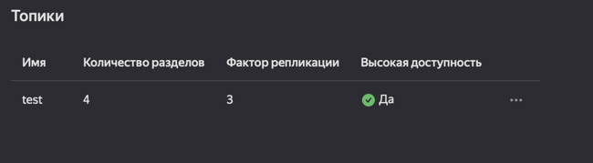

<h1>Задание 1</h1>
В данном задании был развернут кластер Kafka в облаке, протестирована отпарвка и получение сообщений из топика

Получение сертификата для подключения к Кафке в облаке

Добавление сертификата к truststore.jks
keytool -importcert -alias YandexCA -file /usr/local/share/ca-certificates/Yandex/YandexInternalRootCA.crt -keystore kafka.truststore.jks -storepass password -noprompt

Настройка кластера в облаке

Успешная отправка сообщений через Producer в топик test

Успешное чтение сообщений через Consumer в топике test

Топик в облаке 

Пользователи 

Добавил и успешно развернул Schema Registry

Запуск через Producer - ProducerWithSR, Consumer - ConsumerWithSR

Отправка сообщения 

Прием сообщения

<h1>Задание 2</h1>
Сервиса nifi в облаке я не нашел, потому развернул его локлаьно.

Строим ETL в NiFi

В папку nifi_data перекладываем файл из папки temp_data
Nifi его подхватывает 

Данные успешно отправлены в топик кафки

Настройки Producer Nifi

